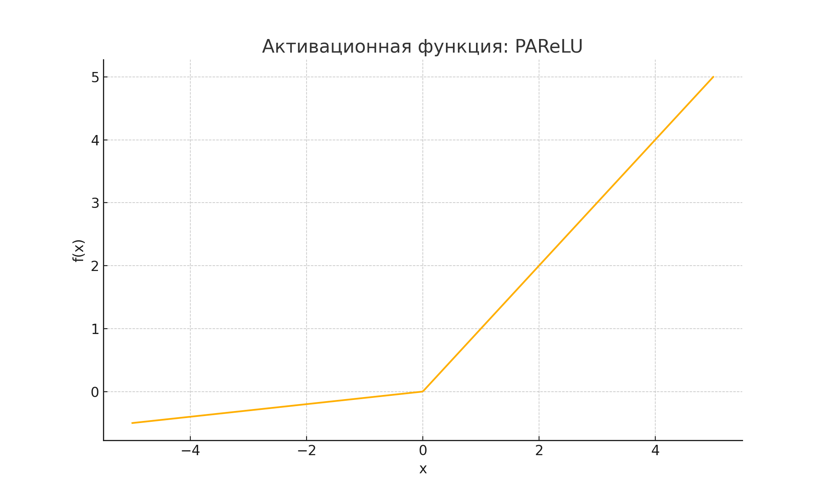

# Исследование функций активации и оптимизаторов на Tiny ImageNet

##  Описание проекта

Целью данного проекта является изучение влияния различных **функций активации** и **оптимизаторов** на **сходимость нейросетей** при классификации изображений. В качестве эталонного датасета использован [Tiny ImageNet](https://www.kaggle.com/datasets/akash2sharma/tiny-imagenet), включающий 200 категорий изображений размером 64×64.

---

##  Используемая архитектура нейросети

- **Вход**: 64×64×3 изображения  
- **Скрытый слой**: 512 нейронов  
- **Выход**: 200 классов  
- **Функция потерь**: `CrossEntropy`  
- **Batch size**: 64  
- **Эпох**: 10  
- **Инициализация**: Xavier (Glorot Uniform)

---

##  Исследуемые функции активации

- `ReLU`  
- `Swish`  
- `GELU`  
- `PAReLU`  
- `DynamicSwish`  
- `AdaptiveGELUMish`

---
## Используемые паттерны 
- Strategy Pattern
- Factory Pattern
- Template Method

---

### Графики активаций:

<p align="center">
  
  
  
</p>
<p align="center">
  
  
  
</p>

---

##  Использованные оптимизаторы

- `SGD`
- `Adam`
- `AdamW`
- `RAdam`
- `Sophia`
- `LAMB`

Также протестированы комбинации:  
- `SGD + Adam`  
- `AdamW + RAdam`  
- `SGD + Adam + RAdam`

---

##  Результаты

### 1. Все конфигурации:

<p align="center">
  
</p>

### 2. Только одиночные оптимизаторы:

<p align="center">
  
</p>


---

##  Лучшие конфигурации

| Активация       | Оптимизатор | Loss @ Epoch 10 | Accuracy @ Epoch 10 | Время (сек) |
|-----------------|-------------|------------------|----------------------|-------------|
| Swish           | AdamW       | **0.1557**       | **82.4%**            | 136         |
| PAReLU          | RAdam       | 0.1660           | 81.1%                | 145         |
| GELU            | Sophia      | 0.1823           | 79.8%                | 157         |

---

##  Выводы

- **GELU** и **Swish** обеспечивают лучшую сходимость.
- **Adam**, **RAdam** и **AdamW** — наиболее устойчивые оптимизаторы.
- Комбинации дают выигрыш в устойчивости, но часто переусложняют обучение.
- Sophia требует дальнейшей адаптации, а LAMB — хорош для масштабируемости.

---

## Требования

- Python 3.10 или выше
- Poetry (менеджер зависимостей)
- Bash

## Установка

1. Клонируйте репозиторий:
```bash
git clone https://github.com/your-username/neural-optimizer-full.git
cd neural-optimizer-full
```

2. Установите Poetry (если еще не установлен):
```bash
curl -sSL https://install.python-poetry.org | python3 -
```

3. Установите зависимости проекта:
```bash
poetry install
```

## Скачивание датасета

Для скачивания датасета выполните следующую команду:
```bash
bash scripts/download_dataset.sh
```

## Запуск проекта

1. Активируйте виртуальное окружение:
```bash
poetry shell
```

2. Запустите основной скрипт:
```bash
python main.py
```

## Структура проекта

- `config/` - конфигурационные файлы
- `data/` - директория для датасетов
- `experiments/` - результаты экспериментов
- `models/` - модели нейронных сетей
- `optimizers/` - реализации оптимизаторов
- `strategies/` - стратегии обучения
- `factories/` - фабрики для создания объектов
- `training/` - скрипты для обучения
- `utils/` - вспомогательные функции

## Конфигурация

Основные параметры проекта можно настроить в файле `config.yaml`.


